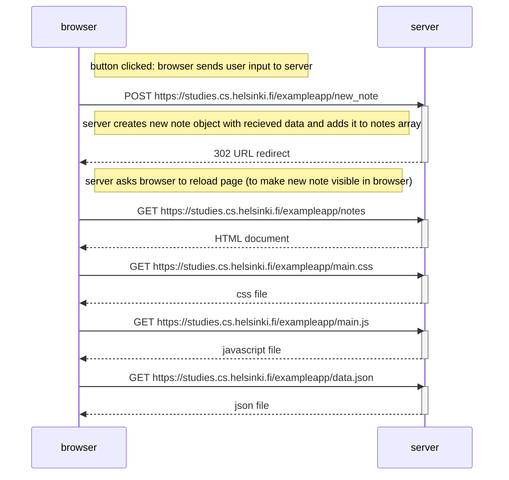

# 0.4 New Note Diagram

Sequence diagram of new note created on the page: https://studies.cs.helsinki.fi/exampleapp/notes

---

```mermaid
sequenceDiagram
  participant browser
  participant server

  Note right of browser: button clicked: browser sends user input to server
  browser->>server: POST 	https://studies.cs.helsinki.fi/exampleapp/new_note
  activate server
  Note left of server: server creates new note object with recieved data and adds it to notes array
  server-->>browser: 302 URL redirect
  deactivate server
  Note right of browser: server asks browser to reload page (to make new note visible in browser)

  browser->>server: GET https://studies.cs.helsinki.fi/exampleapp/notes
  activate server
  server-->>browser: HTML document
  deactivate server

  browser->>server: GET https://studies.cs.helsinki.fi/exampleapp/main.css
  activate server
  server-->>browser: css file
  deactivate server

  browser->>server: GET https://studies.cs.helsinki.fi/exampleapp/main.js
  activate server
  server-->>browser: javascript file
  deactivate server

  browser->>server: GET https://studies.cs.helsinki.fi/exampleapp/data.json
  activate server
  server-->>browser: json file
  deactivate server

```
