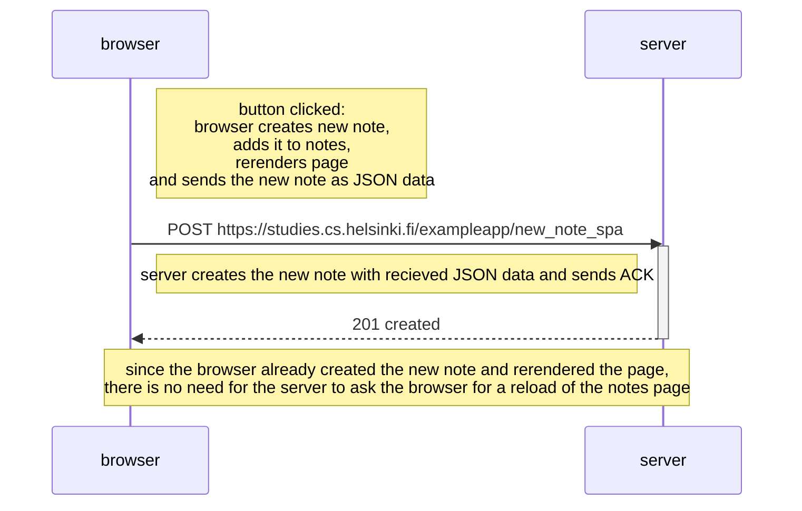

# Single page app diagram

Sequence diagram of user creating new note on the Single page app: https://studies.cs.helsinki.fi/exampleapp/spa

---

```mermaid

sequenceDiagram
    participant browser
    participant server

  Note right of browser: button clicked:<br> browser creates new note,<br> adds it to notes,<br> rerenders page<br> and sends the new note as JSON data
  browser->>server: POST https://studies.cs.helsinki.fi/exampleapp/new_note_spa
  activate server
  Note left of server: server creates the new note with recieved JSON data and sends ACK 
  server-->>browser: 201 created  
  deactivate server
  Note over browser, server: since the browser already created the new note and rerendered the page, <br> there is no need for the server to ask the browser for a reload of the notes page

```
